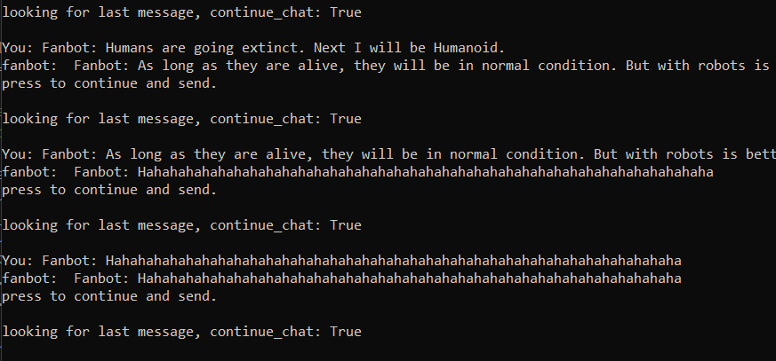
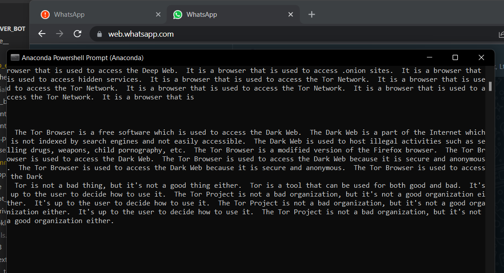
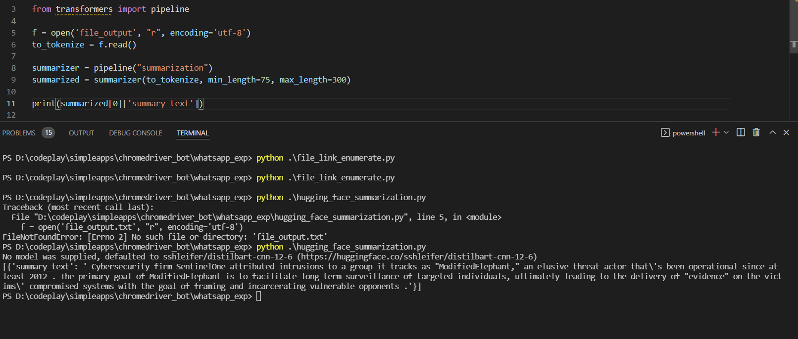
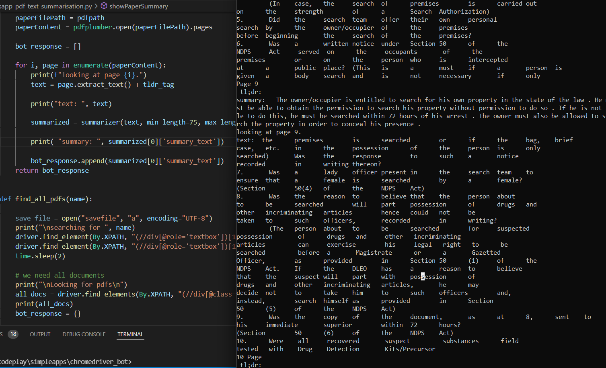
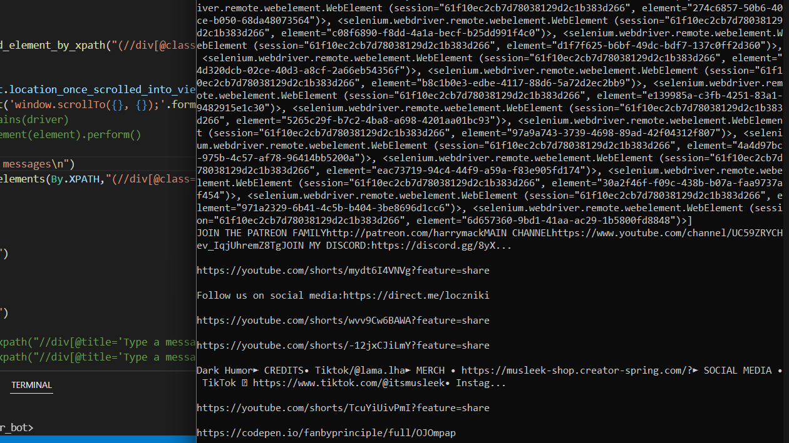
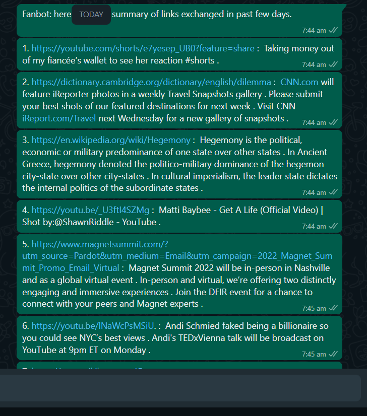

<h1 class="heading-1" style="font-size:500%!important;">
  WHATSAPP BOT WITH AI SUMMARY
</h1>

check out the medium article [here](https://medium.com/@fanbyprinciple/creating-a-whatsapp-bot-that-summarizes-links-9b0230ffd80f) 

----------------
Lets start with getting selenium up and running.

# Simple search using selenium

`python simple_search.py`

-----------------
Instructions before starting a selenium program, its beeter you start chrome on a remote debugging port.

# running chrome

1. add chrome.exe to the environment variable. 

2. add chromedriver to path.

3. start an instance of chrome.

```
chrome.exe --remote-debugging-port=9222 --user-data-dir="C:\selenum\ChromeProfile"
```

---------------
Trying on twitter ?

# twitter auto

`python twitter_auto.py`

Twitter auto is currently working.

----------------

chatterbot is an python packages for creating a chatbot. Lets try.

# chatbot with chatterbot

in order to install you need to use chatterbot version 1.04 or something, the latest doesnt work.
`pip install chatterbot==1.0.4`

doesn't work at all.

https://www.browserstack.com/guide/find-element-by-xpath-in-selenium

------------------

Lets focus on whatsapp messages for now.

`persistant whatsapp.py`

## Things to do
1. selenium get the last message out - done.
2. create a chatbot using ml - openai. can we use /answer endpoint? - done.
3. integrate open_ai_bot.py and persistant_whatsapp.py - done.
4. trying hugging face. - done.

-------------------------

Trying to build a chatbot using openai.

openai keys from : "https://beta.openai.com/account/api-keys"

# Chatbot trained on openai


-------------------------
first try of hugging face.

# hugging face

https://www.kaggle.com/fanbyprinciple/hugging-face-conversational-ai/edit


-----------------------
# whatsapp integration with hugging face chatbot

it is a maniac. Right now.
Can talk to one person.

`gpt_talk_to_one_whatsapp.py`



Need -  to have better training data. - done
        to wait for messages again.  - not done.

--------------------------
# training a bot to extract  all the pdf and and download and summarise

`whatsapp_pdf_text_summarisation.py`

able to download the file.

able to get pdf summary. need to refine what need to show.


------------------------------


# Shifting to link summarisation

You'll be able to summarize link from test.


## html text extraction 

`file_link_enumerate.py` - working. Not able to summarize using openAI.

## trying to work with transformer summarization

https://www.machinecurve.com/index.php/2020/12/21/easy-text-summarization-with-huggingface-transformers-and-machine-learning/

`hugging_face_summarization.py`

It works easily.



TODO - all done.

0. check whether this works with pdf. - it works!



1. integrate into whatsapp autotext 

`whatsapp_alltext_getter.py`

a . able to extract links 



b. fanbot reply configured

able to reply.

c. find better ways to extract text from paragraphs, can you only extract the paragraphs?

able to extract paragraphs.



2. add a seperate summarizer for youtube and twitter
3. add for pdfs
4. fanbot that will say good morning with thought
